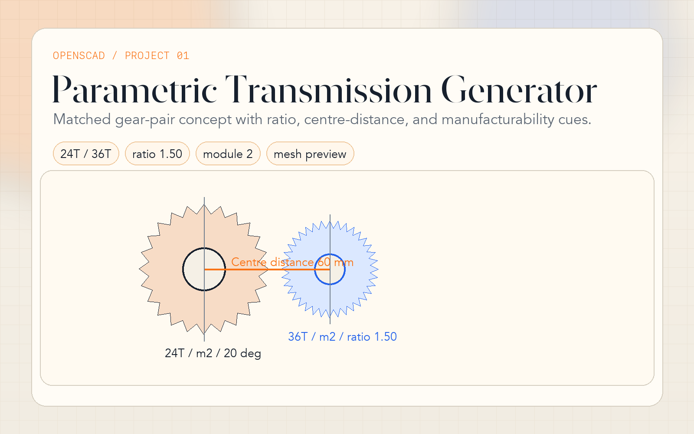

# 01 · Parametric Transmission Generator

**Tool:** OpenSCAD ≥ 2021.01  
**Outputs:** `.stl` · `.dxf` · `.amf`

---



## Engineering Problem

Generate reusable gears and matched gear pairs from code instead of remodeling every variant by hand. The project is aimed at quick transmission studies for prototypes, printed drivetrains, and reviewable mechanical concepts.

> **Why this matters:** this is no longer a single gear demo. It behaves like a small transmission tool: per-gear configuration, pair metrics, and manufacturability warnings all live in one script.

## What Changed

- Public OpenSCAD interface built around `gear(...)` and `gear_pair(...)`
- `single`, `pair`, and `mesh_preview` modes
- Independent mate-gear geometry instead of reusing the primary tooth definition
- Echo output for ratio, centre distance, pitch diameters, base circles, and warning conditions
- Input checks for low tooth count, incompatible pair settings, and hub/root conflicts

## Core Parameters

| Group | Primary | Mate | Notes |
|---|---|---|---|
| Tooth geometry | `module_size`, `num_teeth`, `pressure_angle`, `backlash` | `mate_module_size`, `mate_teeth`, `mate_pressure_angle`, `mate_backlash` | Pair mode supports independent inputs |
| Body | `gear_height` | `mate_gear_height` | Face width per gear |
| Hub / bore | `hub_diameter`, `hub_height`, `bore_diameter` | `mate_hub_diameter`, `mate_hub_height`, `mate_bore_diameter` | Lets the pair reflect real shafts |
| Features | `enable_spokes`, `keyway_width`, `tip_chamfer`, `herringbone` | Mate equivalents | Same feature set on both gears |
| Preview | `render_mode`, `mesh_rotation_deg`, `show_centerline` | — | For quick transmission studies |

## Technical Signals

- **Real involute geometry:** tooth flanks are still generated from base-circle math
- **Pair-level reasoning:** centre distance and ratio are reported directly in the script output
- **Warning-driven workflow:** low-tooth and incompatible pair combinations call out likely issues
- **Reusable interface:** the mate gear is parameterized independently instead of piggybacking on globals

## Usage

```bash
# Default single gear
openscad parametric_gear.scad

# Matched pair preview
openscad -o gear_pair.stl \
  -D 'render_mode="pair"' \
  -D 'mate_teeth=36' \
  parametric_gear.scad

# Herringbone pair with different bores
openscad -o herringbone_pair.stl \
  -D 'render_mode="mesh_preview"' \
  -D 'herringbone=true' \
  -D 'mate_herringbone=true' \
  -D 'mate_bore_diameter=10' \
  parametric_gear.scad
```

Hero shot command: [../PORTFOLIO_SHOTS.md](../PORTFOLIO_SHOTS.md)

## Case Study Notes

- **Constraint:** keep a fast way to explore transmission ratio changes without rebuilding geometry manually.
- **Decision:** expose both gears through the same public module interface and compute pair metrics directly in the script.
- **Manufacturing signal:** bores, keyways, tip breaks, and herringbone options reflect downstream use rather than only visual shape variation.
- **Limitation:** this is still a geometry-first tool. It does not compute contact stress, efficiency, or real load rating.

## Next-Step Realism

The natural next upgrade would be profile shift, multi-stage gear trains, and a more formal interference/contact-ratio analysis layer.
