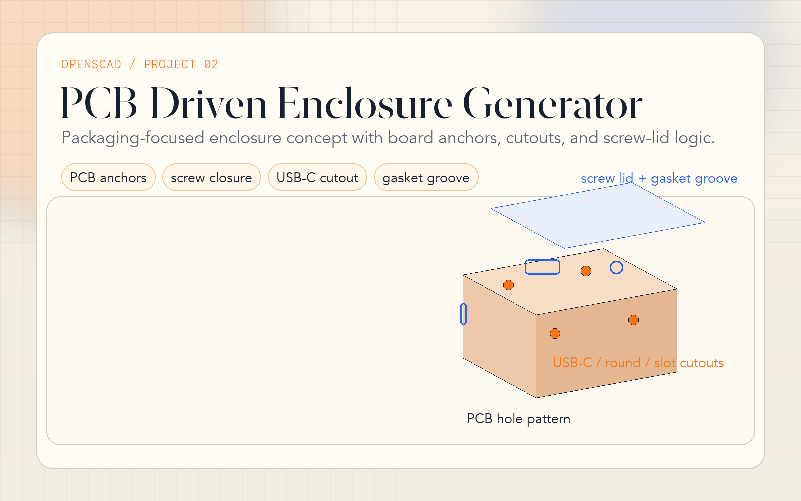

# 02 · PCB-Driven Electronics Enclosure Generator

**Tool:** OpenSCAD ≥ 2021.01  
**Output:** `.stl`

---



## Engineering Problem

Build enclosure variants around a PCB mounting pattern, lid strategy, and I/O layout rather than only resizing a generic box. The script is structured to feel closer to product packaging work than to a simple shell demo.

> **Why this matters:** it shows packaging logic, closure strategy, and wall-interface planning in one model. That is a stronger hardware/CAD signal than a plain rectangular enclosure.

## What Changed

- PCB standoffs now follow an explicit `pcb_hole_pattern`
- Two closure paths: `closure_mode = "snap"` or `closure_mode = "screw"`
- Real wall cutout collections: `rear_cutouts`, `front_cutouts`, `left_cutouts`, `right_cutouts`
- `lip_chamfer` now drives an actual tapered register geometry
- Optional `gasket_enabled` groove for sealing studies
- Exploded and cross-section previews remain available with the richer closure/cutout logic

## Public Parameters

| Group | Key Parameters | Purpose |
|---|---|---|
| Envelope | `inner_w`, `inner_d`, `inner_h`, `wall`, `draft_angle` | Main cavity and shell |
| PCB mounting | `pcb_hole_pattern`, `standoff_h`, `standoff_od`, `insert_d` | Board-driven anchor layout |
| Closure | `closure_mode`, `register_h`, `register_w`, `lip_chamfer` | Lid alignment and fit strategy |
| Screw lid | `screw_post_od`, `screw_post_offset`, `screw_pilot_d` | Corner post geometry |
| I/O walls | `rear_cutouts`, `front_cutouts`, `left_cutouts`, `right_cutouts` | Connector and switch planning |
| Sealing | `gasket_enabled`, `gasket_groove_w`, `gasket_groove_d` | Gasket channel concepting |

## Example Inputs

```scad
pcb_hole_pattern = [
    [8, 8],
    [72, 8],
    [72, 52],
    [8, 52]
];

rear_cutouts = [
    [22, 10, 12, 9, "usb_c"],
    [52, 10, 8, 8, "round"]
];
```

Each cutout entry is:

```text
[position_along_wall, z_from_floor, width, height, kind]
```

## Usage

```bash
# Default snap-closure enclosure
openscad enclosure.scad

# Screw-fastened lid
openscad -o enclosure_screw.stl \
  -D 'closure_mode="screw"' \
  enclosure.scad

# Sealed concept with custom cavity
openscad -o enclosure_gasketed.stl \
  -D 'gasket_enabled=true' \
  -D 'inner_w=100' -D 'inner_d=70' -D 'inner_h=35' \
  enclosure.scad
```

Hero shot command: [../PORTFOLIO_SHOTS.md](../PORTFOLIO_SHOTS.md)

## Case Study Notes

- **Constraint:** support enclosure iteration around real board mounts and I/O placement instead of only changing box size.
- **Decision:** drive mounting by a hole-pattern array and wall interfaces by cutout arrays, then let closure strategy switch between snap-fit and screw-fastened variants.
- **Manufacturing signal:** draft, register fit, screw posts, and gasket groove show DFM/handoff thinking instead of pure visual modeling.
- **Limitation:** the script does not route cable strain relief, EMI features, or exact fastener/thread standards.

## Next-Step Realism

The next practical upgrade would be named connector presets, lid-specific insert bosses, and board keepout rules tied to cutout placement.
