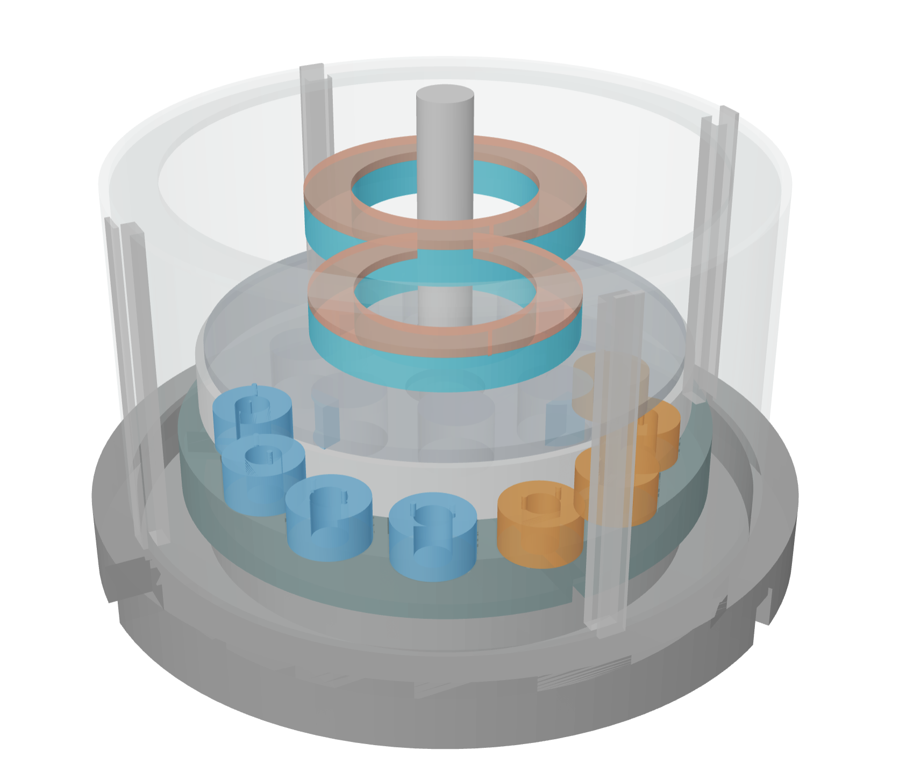

# 02 · Parametric Magnetic Levitation Motor

**Tool:** OpenSCAD ≥ 2021.01  
**Outputs:** `.stl` · `.dxf` · `.amf`

---



## Engineering Problem

Design a parametric axial-flux motor where the rotor levitates entirely on permanent magnets — eliminating all mechanical friction from the bearing system. The only energy input required is the three-phase drive signal to the stator coils. Because there is no contact friction, the motor sustains rotation at extremely low input power.

> **How it works:** opposing permanent-magnet rings on the stator and rotor (same polarity facing each other) create a repulsive force that suspends the rotor axially. A Halbach magnet array on the rotor concentrates magnetic flux toward the stator, boosting torque coupling while shielding the top face. Three-phase stator coils then drive rotation using standard BLDC commutation.

## Render Modes

| Mode | Description |
|---|---|
| `assembled` | Full unit with transparent acrylic shroud |
| `exploded` | All layers separated vertically for inspection |
| `rotor_only` | Halbach rotor disk + shaft collar |
| `stator_only` | Stator disk + 3-phase coil array |
| `field_section` | Vertical cross-section cut through the assembly |

## Core Parameters

| Group | Parameter | Default | Notes |
|---|---|---|---|
| Envelope | `motor_diameter` | 140 mm | Outer housing diameter |
| Envelope | `motor_height` | 90 mm | Full assembly height |
| Shaft | `shaft_diameter` | 12 mm | Central shaft OD |
| Levitation | `lev_ring_od / id` | 60 / 40 mm | Ring bearing dimensions |
| Levitation | `lev_gap` | 4 mm | Air gap between opposing rings |
| Levitation | `lev_pairs` | 2 | Number of ring pairs (axial stability) |
| Rotor | `rotor_diameter` | 110 mm | Rotor disk OD |
| Rotor | `halbach_magnets` | 16 | Magnet count (must be ÷ 4) |
| Rotor | `halbach_radius` | 44 mm | Magnet placement radius |
| Stator | `coil_phases` | 3 | Drive phases |
| Stator | `coils_per_phase` | 4 | Coils per phase (12 total) |
| Stator | `coil_radius` | 44 mm | Coil placement radius |

## What the Model Contains

**Base plinth** — machined aluminium plinth with cable exit slots (3-phase, 120° apart), weight-reduction bore ring, and rubber feet.

**Shaft** — central steel shaft with rotor seat collar.

**Levitation bearing system** — pairs of opposing permanent-magnet rings (blue = stator-fixed, red = rotor-floating). Same-polarity rings repel, suspending the rotor with a configurable air gap. Two pairs provide both axial and radial stability.

**Halbach rotor disk** — the magnet sequence rotates 90° per magnet (N↑ → N→ → N↓ → N←), which doubles flux density on the stator side and nearly cancels it on the top face. Eight mass-reduction pockets reduce rotational inertia. A steel flux-return plate on top closes the magnetic circuit.

**Stator disk** — dark carrier disk with 12 coil pockets (4 per phase), radial cable routing channels, and colour-coded 3-phase winding array (red / green / blue).

**Transparent shroud** — acrylic cylindrical enclosure with four support struts and a top cap ring, allowing full visual inspection while containing the assembly.

## Computed Warnings (via echo)

- Halbach magnet count must be divisible by 4
- Magnets must not extend beyond rotor edge
- Coils must not extend beyond stator edge
- Rotor and stator radii should be within 6 mm for good coupling

## Usage

```bash
# Default assembled view
openscad maglev_motor.scad

# Exploded view
openscad -D 'render_mode="exploded"' maglev_motor.scad

# Rotor assembly only
openscad -D 'render_mode="rotor_only"' maglev_motor.scad

# Stator assembly only
openscad -D 'render_mode="stator_only"' maglev_motor.scad

# Cross-section
openscad -D 'render_mode="field_section"' maglev_motor.scad

# Scale up — 200 mm motor with 24 magnets
openscad -D 'motor_diameter=200' \
  -D 'halbach_magnets=24' \
  -D 'coils_per_phase=6' \
  maglev_motor.scad
```

## Case Study Notes

- **Constraint:** eliminate bearing friction as the dominant energy loss mechanism, and make all key geometry (coil count, magnet array, air gap) parametric for design exploration.
- **Decision:** Halbach array over a simple alternating array because it doubles the usable flux on the stator side without adding magnets — a real engineering trade-off between magnet cost and torque density.
- **Stability decision:** two levitation ring pairs instead of one; a single axial pair is statically unstable laterally, so a second pair spaced axially provides the restoring force needed for passive stability.
- **Limitation:** the model is geometry-first. Magnetic flux paths, cogging torque, thermal rise in windings, and bearing stiffness all require FEM simulation outside of this CAD scope.

## Next-Step Realism

Natural upgrades: rotor position sensor geometry (Hall effect), encoder disk on shaft top, active damping coil ring for lateral stability, and an end-cap with integrated driver PCB mount.
