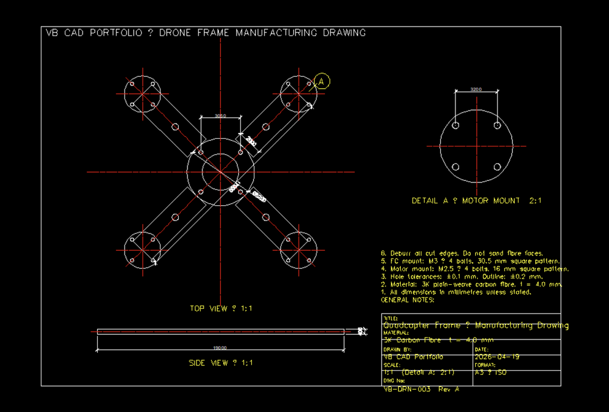

# 03 · Drone Frame Manufacturing Handoff Drawing

**Format:** DXF R2010 (AC1024)  
**Generator:** Python 3 + ezdxf  
**Compatible:** AutoCAD · LibreCAD · QCAD · FreeCAD · DraftSight

---



## Engineering Problem

Produce a complete manufacturing handoff drawing for an X-configuration quadcopter frame cut from 4 mm carbon fibre plate. The drawing must carry all geometry, tolerances, and callouts needed to hand the file directly to a waterjet or CNC router operator — no verbal instructions required.

> **Why this matters:** a DXF without dimensions, tolerances, and notes is just a cut path. This drawing adds the engineering layer: orthographic views, detail callouts, a structured title block, and general notes that define material, finish, and fastener specs.

## Drawing Contents

### Views

| View | Scale | Description |
|---|---|---|
| Top view | 1:1 | Full frame outline — arms, centre plate, all hole positions |
| Side view | 1:1 | Frame profile showing 4 mm plate thickness |
| Detail A | 2:1 | Motor mount bolt pattern (enlarged for clarity) |

### Layers

| Layer | Colour | Use |
|---|---|---|
| `OUTLINE` | White/black | Part geometry, hole circles |
| `CENTERLINE` | Red | Centre marks, axis lines |
| `DIMENSION` | Blue | All dimension entities |
| `HIDDEN` | Green | Hidden/reference lines |
| `TITLE_BLOCK` | White | Sheet border, title block |
| `NOTES` | Yellow | Annotations, labels, notes |

### Title Block

- Drawing number: VB-DRN-003 Rev A
- Material callout: 3K plain-weave carbon fibre, t = 4.0 mm
- Scale: 1:1 (Detail A: 2:1)
- Format: A3 ISO

## Frame Specifications

| Parameter | Value |
|---|---|
| Motor-to-motor diagonal | 240.4 mm (~9.5") |
| Arm length (centre → motor) | 85 mm |
| Arm width | 20 mm |
| Centre plate OD | 52 mm |
| Motor bolt pattern | 16 × 16 mm, M2.5 |
| FC mount pattern | 30.5 × 30.5 mm, M3 |
| Frame thickness | 4.0 mm |
| Arm lightening holes | ⌀5 mm, 1 per arm |

## Usage

```bash
# Regenerate the DXF from source
pip install ezdxf
python3 generate_drone_drawing.py
# → drone_frame.dxf

# Open in LibreCAD / QCAD (free)
# Open in FreeCAD → TechDraw workbench

# Adjust frame parameters at the top of generate_drone_drawing.py:
#   ARM_LENGTH, ARM_WIDTH, CENTER_OD, MOTOR_PATTERN, FC_MOUNT ...
# then re-run to regenerate.
```

## Case Study Notes

- **Constraint:** deliver a file that goes directly to fabrication — not a sketch, not a render — a complete 2D handoff drawing with dimensions, notes, and a title block.
- **Decision:** generate the DXF programmatically (Python + ezdxf) rather than draw it manually, so the drawing stays in sync with frame parameters and can be regenerated for any variant.
- **Detail callout decision:** the motor mount pattern (M2.5, 16 mm) is small enough that dimensions would clutter the 1:1 view — so it is broken out as Detail A at 2:1 with a bubble callout.
- **Limitation:** the drawing covers the centre plate and arms as a single-piece carbon part. A full assembly drawing with standoffs, stack, and motors is out of scope here.

## Next-Step Realism

Natural upgrades: a bottom plate view with different hole pattern, arm fold-line marks for a folding-arm variant, a BOM table with fastener specs, and a revision block.
