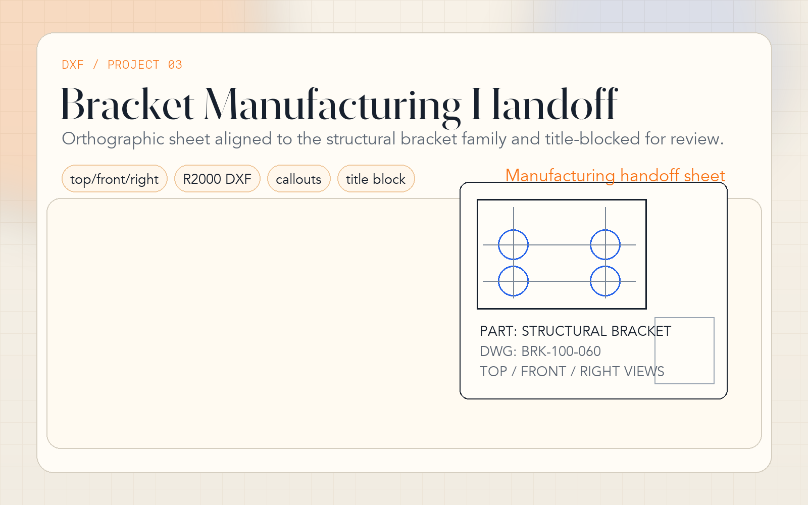

# 03 · Bracket Manufacturing Handoff Drawing

**Format:** DXF R2000 (AC1015)  
**Compatible:** AutoCAD · LibreCAD · QCAD · FreeCAD · DraftSight

---



## Engineering Problem

Turn the structural bracket family into a reviewable manufacturing handoff artefact instead of leaving the portfolio at the 3D-model stage. This drawing is now explicitly tied to the bracket geometry in Project 04.

> **Linked part:** [`../04_cadquery_bracket/bracket.py`](../04_cadquery_bracket/bracket.py)

## What The Sheet Shows

- **Top view:** 100 × 60 base flange with the default 60 × 30 hole pattern
- **Front view:** overall bracket height and leg-hole layout
- **Right view:** L-profile with 6 mm stock thickness and vertical leg
- **Title block + notes:** material, drawing number, scale, tolerances, deburr and finish notes

## Why It Strengthens The Portfolio

- It demonstrates that the bracket project ends in a handoff artefact, not only a solid model
- It connects geometry, callouts, material, and notes in the same workflow
- It shows awareness of manufacturing communication, not only CAD scripting

## Default Geometry Reference

```text
Bracket family default:
100 mm flange width
60 mm flange depth
60 mm leg height
6 mm thickness
4× Ø8.5 THRU, Ø14 counterbore on base
4× Ø6.5 THRU on the leg
```

## Usage

```bash
librecad mounting_bracket.dxf
freecad mounting_bracket.dxf
qcad -print mounting_bracket.dxf
```

Shot workflow: [../PORTFOLIO_SHOTS.md](../PORTFOLIO_SHOTS.md)

## Case Study Notes

- **Constraint:** make the bracket look manufacturable and reviewable to another engineer.
- **Decision:** keep the DXF as a clean companion deliverable to the CadQuery model rather than a disconnected drafting exercise.
- **Handoff signal:** views, callouts, title-block data, and general notes now align with the bracket family defaults.
- **Limitation:** this is still a compact portfolio sheet, not a full released drawing pack with revision history and GD&T stack-up.
