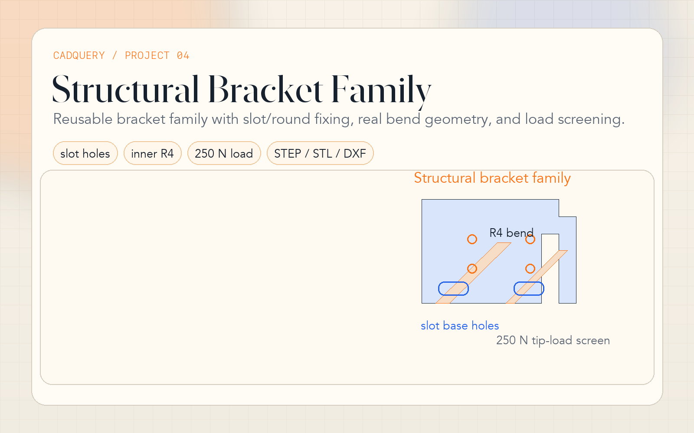

# 04 · Structural Bracket Family — CadQuery

**Tool:** CadQuery 2.x (Python 3.9+)  
**Outputs:** `.step` · `.stl` · `.dxf`

---



## Engineering Problem

Generate a reusable bracket family from a configuration object instead of keeping a one-off support bracket. The script is aimed at practical hardware mounting work: adjustable base fixing, realistic bend geometry, weight reduction, and a quick first-pass load estimate.

> **Why this matters:** it combines geometry generation, export, and a lightweight engineering check in one workflow.

## What Changed

- Base shape now uses a **real inner bend radius** in the L-profile
- `BracketConfig` fields are all active: `inner_fillet_r`, `cutout_fillet`, hole type, and load inputs are no longer decorative
- Base mounting holes support `round` or `slot`
- The leg uses multi-row fastener holes by default
- Load output now reports moment, stress, deflection, and safety factor approximation
- The drawing companion in Project 03 is aligned to this bracket family

## Default Configuration

```python
BracketConfig(
    flange_w=100.0,
    flange_depth=60.0,
    leg_h=60.0,
    thickness=6.0,
    inner_fillet_r=4.0,
    base_hole_type="round",
    base_hole_d=8.5,
    base_cbore_d=14.0,
    leg_hole_rows=2,
    tip_load_n=250.0,
)
```

## CLI Usage

```bash
pip install cadquery

# Default family member
python bracket.py

# Slotted base holes
python bracket.py --base-hole-type slot --base-slot-len 24

# Heavier load estimate with thicker stock
python bracket.py --thickness 8 --tip-load-n 400
```

Hero shot command: [../PORTFOLIO_SHOTS.md](../PORTFOLIO_SHOTS.md)

## Case Study Notes

- **Constraint:** build a bracket that looks like a configurable part family, not a static sample.
- **Decision:** move the core geometry to an L-profile with inner radius, then layer gussets, hole patterns, rounded cutout geometry, and export automation on top.
- **Manufacturing signal:** counterbores, slot option, multi-format export, and the linked DXF drawing position this as a handoff-ready component.
- **Limitation:** the load calculation is intentionally simple and conservative. It is useful for portfolio-level reasoning, not certification.

## Integration

```python
from bracket import BracketConfig, analyse, build_bracket

cfg = BracketConfig(base_hole_type="slot", tip_load_n=300)
model = build_bracket(cfg)
info = analyse(model, cfg)
print(info["load_case"])
```
