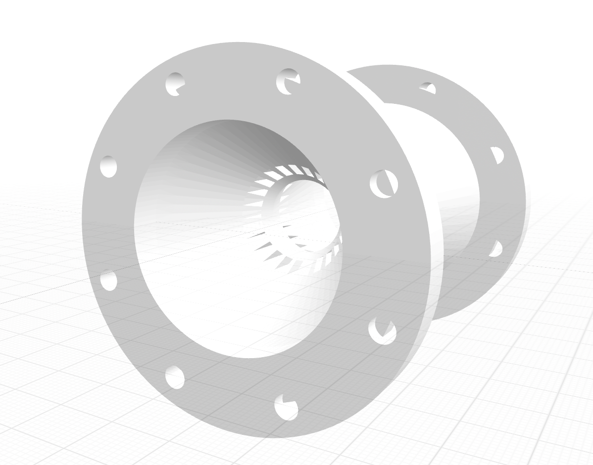

# 04 · De Laval Nozzle with Regenerative Cooling

**Tool:** CadQuery 2.x (Python 3.9+)  
**Outputs:** `.step` · `.stl` (full + cross-section)

---



## Engineering Problem

Model a parametric convergent-divergent rocket nozzle with an integrated regenerative cooling channel network. Every dimension — throat size, area ratio, channel count, wall thickness — is driven by configuration values. The script reports analysis output alongside geometry: area ratio, channel pitch, land width, and wall margin warnings.

> **How regenerative cooling works:** propellant flows counter-directionally through axial slots in the nozzle wall — from the exit toward the throat — before entering the combustion chamber. This absorbs heat from the highest thermal-load region (the throat) while pre-heating the propellant, improving specific impulse. The outer jacket seals the channel network.

## Default Configuration

```python
NozzleConfig(
    inlet_d      = 82.0,    # combustion-side inner diameter [mm]
    throat_d     = 30.0,    # throat inner diameter [mm]
    exit_d       = 76.0,    # nozzle exit inner diameter [mm]
    conv_length  = 50.0,    # converging section [mm]
    div_length   = 95.0,    # diverging section [mm]
    wall_t       = 7.0,     # inner liner wall thickness [mm]
    jacket_t     = 2.5,     # outer jacket (channel cover) [mm]
    channel_count = 24,     # axial cooling channels
    channel_w    = 3.2,     # channel slot width [mm]
    channel_depth = 4.0,    # channel slot depth [mm]
)
```

## Analysis Output (default)

```
  Area ratio (Ae / At):     6.418
  Throat circumference:     138.2 mm
  Channel pitch:            5.76 mm
  Land width:               2.56 mm
  Wall below channel:       3.0 mm
  Bolt pattern:             8× ⌀8.5 on ⌀116.0 PCD
  Coolant ports:            2× ⌀10.0 (inlet + exit manifold)
```

## What the Model Contains

**Inner liner** — revolved closed profile (inlet → throat → exit) with uniform wall thickness. The converging and diverging sections are straight-cone approximations with an area ratio of 6.4.

**Cooling channels** — 24 axial rectangular slots cut into the outer surface of the liner wall, evenly distributed around the circumference. At the throat (most thermally loaded point): 2.56 mm land width between channels, 3.0 mm of wall remaining below channels.

**Outer jacket** — thin revolved shell (2.5 mm) that seals the channel network and forms the coolant pressure boundary.

**Manifold rings** — inlet and exit annular rings with radial ⌀10 mm feed ports. Coolant enters at the exit manifold and exits at the inlet manifold (counter-flow path).

**Flanges** — inlet and exit flanges with 8× M8 bolts on 116 mm PCD.

## CLI Usage

```bash
pip install cadquery

# Default nozzle + cross-section export
python3 nozzle.py --section

# Smaller thruster (25 mm throat)
python3 nozzle.py --throat-d 25 --exit-d 60 --section

# More cooling channels on a wider nozzle
python3 nozzle.py --throat-d 40 --channels 32 --channel-w 3.0

# Thicker wall with deeper channels
python3 nozzle.py --wall-t 9 --channel-depth 5.5 --section
```

## Case Study Notes

- **Constraint:** show a nozzle that signals real engineering decisions — thermal management, wall sizing, channel geometry — not just the outer bell shape.
- **Decision:** 24 axial channels rather than helical, because axial channels are manufacturable by EDM or milling and their fit at the throat is directly analysable from circumference geometry.
- **Wall margin decision:** `wall_t - channel_depth ≥ 2.0 mm` is enforced as a warning. Below this, the liner becomes structurally marginal under combustion pressure.
- **Jacket decision:** a separate thin outer jacket (2.5 mm) rather than a thick outer wall, to keep the coolant circuit pressure-rated without over-building the structural wall.
- **Limitation:** the model is geometry-first. Combustion pressure loads, thermal gradients, and stress concentrations at channel edges all require FEA/CFD outside this scope.

## Next-Step Realism

Natural upgrades: a Rao-contour diverging section (bell-optimised for minimum length), a receiver flange for the combustion chamber, regenerative cooling inlet/outlet plumbing geometry, and a parametric throat insert for ablative or ceramic liner variants.
