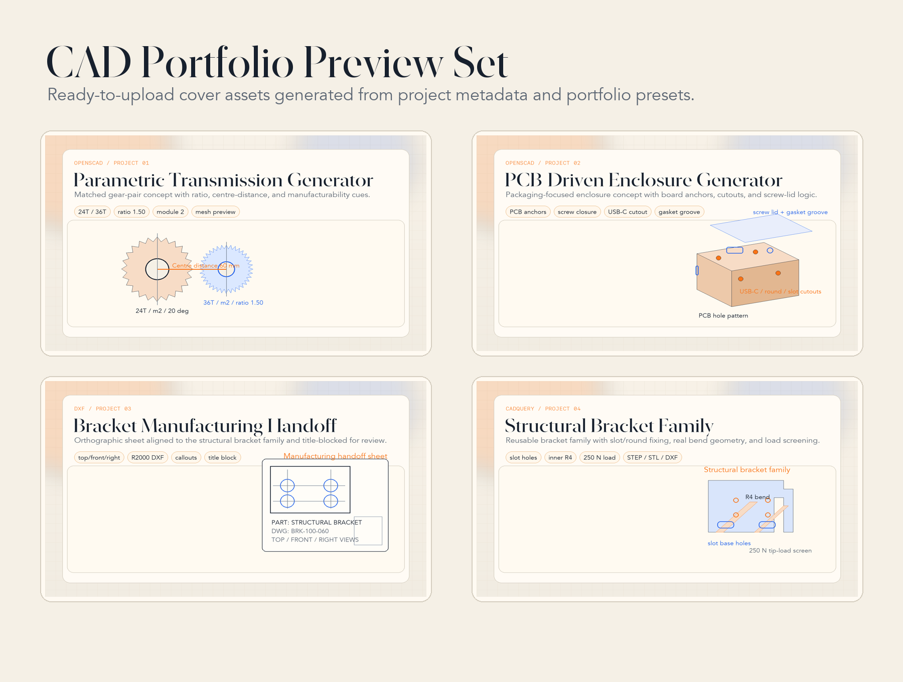

# CAD Portfolio

Code-driven mechanical design portfolio focused on parametric geometry, fabrication-aware decisions, and clean technical handoff.

## Portfolio Surface

This repository is now structured with three presentation layers:

- [Landing page](index.html) for a stronger first impression
- Root `README` for a concise portfolio summary
- Project notes from [01](01_parametric_gear/README.md) to [04](04_cadquery_bracket/README.md) for deeper review

For a quick local preview:

```bash
python3 -m http.server
# then open http://localhost:8000
```

## Preview Gallery



| Project | Preview |
|---|---|
| Transmission Generator |  |
| PCB Enclosure |  |
| Structural Bracket |  |
| Manufacturing Handoff |  |
|
Portfolio shot commands and upload order: [PORTFOLIO_SHOTS.md](PORTFOLIO_SHOTS.md)

## What This Portfolio Signals

- Parametric thinking instead of one-off geometry edits
- Code-first CAD workflows that are reproducible and reviewable
- Manufacturing-aware details such as transmission metrics, counterbores, cutout planning, closure strategy, and tolerance notes
- Multiple downstream deliverables: `.stl`, `.step`, `.dxf`, and documentation-friendly previews

## Project Matrix

| Project | Toolchain | Problem Framed | Professional Signal | Outputs |
|---|---|---|---|---|
| [01 · Parametric Transmission Generator](01_parametric_gear/) | OpenSCAD | Explore transmission ratios and gear-pair geometry without redrawing | Involute math, pair metrics, warnings, herringbone support | `.stl` · `.dxf` · `.amf` |
| [02 · PCB-Driven Enclosure Generator](02_enclosure_box/) | OpenSCAD | Package electronics around a board pattern, closure mode, and I/O layout | PCB hole pattern, screw/snap closure, cutout arrays, gasket groove | `.stl` |
| [03 · Bracket Manufacturing Handoff Drawing](03_technical_drawing/) | DXF | Turn the bracket model into a reviewable manufacturing artefact | Orthographic views, callouts, title block, bracket-linked drawing sheet | `.dxf` |
| [04 · Structural Bracket Family](04_cadquery_bracket/) | CadQuery / Python | Generate a practical bracket family with geometry and load-screening output | Inner bend radius, round/slot holes, load estimate, export automation | `.step` · `.stl` · `.dxf` |

## Featured Projects

### 01 · [Parametric Transmission Generator](01_parametric_gear/)

A gear script that now works as a small transmission tool: independent mate-gear configuration, centre-distance reporting, ratio output, and manufacturability warnings.

**Why it matters:** it shows mechanical reasoning at pair level, not only single-part modeling.

### 02 · [PCB-Driven Enclosure Generator](02_enclosure_box/)

A product-style enclosure generator driven by PCB anchor points, lid strategy, cutout arrays, and an optional gasket groove.

**Why it matters:** it reads like packaging and DFM work instead of a generic shell demo.

### 03 · [Bracket Manufacturing Handoff Drawing](03_technical_drawing/)

A DXF sheet tied directly to the bracket family defaults, used as the handoff layer for the 3D model.

**Why it matters:** it demonstrates that the workflow reaches a reviewable drawing deliverable.

### 04 · [Structural Bracket Family](04_cadquery_bracket/)

A CadQuery part family with real inner bend radius, round/slot base holes, multi-row leg holes, and a lightweight load-screening output.

**Why it matters:** it combines geometry, export, and first-pass engineering judgement in one project.

## Tools & Formats

| Project | Tool | Source | Main Deliverables |
|---|---|---|---|
| Transmission Generator | OpenSCAD ≥ 2021.01 | `.scad` | `.stl` · `.dxf` · `.amf` |
| PCB Enclosure | OpenSCAD ≥ 2021.01 | `.scad` | `.stl` |
| Handoff Drawing | Any DXF viewer | `.dxf` | Drawing review |
| Structural Bracket | CadQuery 2.x / Python 3.9+ | `.py` | `.step` · `.stl` · `.dxf` |

## Run Locally

### OpenSCAD Projects

```bash
openscad 01_parametric_gear/parametric_gear.scad
openscad 02_enclosure_box/enclosure.scad

openscad -o gear_m3_z36.stl \
  -D 'module_size=3' \
  -D 'num_teeth=36' \
  01_parametric_gear/parametric_gear.scad

openscad -o enclosure_screw.stl \
  -D 'closure_mode="screw"' \
  02_enclosure_box/enclosure.scad
```

### CadQuery Project

```bash
pip install cadquery
python 04_cadquery_bracket/bracket.py
python 04_cadquery_bracket/bracket.py --base-hole-type slot --base-slot-len 24
```

### Technical Drawing

```text
LibreCAD · QCAD · AutoCAD · FreeCAD · DraftSight
```

## Repository Structure

```text
.
├── assets/previews/
├── index.html
├── styles.css
├── main.js
├── PORTFOLIO_SHOTS.md
├── README.md
├── 01_parametric_gear/
├── 02_enclosure_box/
├── 03_technical_drawing/
├── 04_cadquery_bracket/
└── scripts/
```

## Design Principles

1. **Parametric first**: geometry is controlled by variables, not manual redraws.
2. **Code as CAD**: models can be reviewed, versioned, and adapted quickly.
3. **Production-aware**: decisions account for fit, manufacturing, and export targets.
4. **Clear handoff**: the portfolio includes both geometry and documentation signals.

## License

MIT — see [LICENSE](LICENSE)
