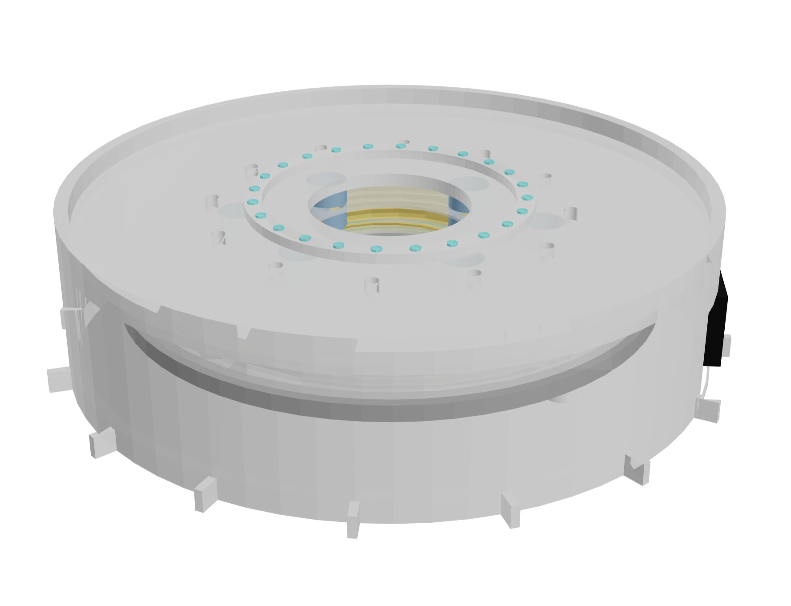

# CAD Portfolio

Parametric mechanical design portfolio built with OpenSCAD, CadQuery, and Python.

## Preview Gallery

| Project | Preview |
|---|---|
| Wireless Resonant Charger |  |
| Magnetic Levitation Motor |  |
| Drone Frame Drawing |  |
| De Laval Nozzle |  |

## Project Matrix

| # | Project | Tool | Key Features | Outputs |
|---|---|---|---|---|
| 01 | [Wireless Resonant Charger](01_wireless_charger/) | OpenSCAD | Spiral coil, ferrite shield, LED ring, IEC inlet, 4 render modes, Wheeler inductance estimate | `.stl` · `.amf` |
| 02 | [Magnetic Levitation Motor](02_maglev_motor/) | OpenSCAD | Halbach array rotor, axial-flux stator, maglev bearing rings, transparent shroud, 5 render modes | `.stl` |
| 03 | [Drone Frame Drawing](03_drone_frame_drawing/) | Python / DXF | A3 manufacturing drawing, top/side/detail views, 6 layers, dimensions, title block | `.dxf` |
| 04 | [De Laval Nozzle](04_laval_nozzle/) | CadQuery / Python | Convergent-divergent bore, 24 cooling channels, outer jacket, manifolds, flanges, area ratio output | `.step` · `.stl` |

## Run the Projects

### OpenSCAD (projects 01 and 02)

```bash
# Wireless charger — assembled view
openscad 01_wireless_charger/wireless_charger.scad

# Charger — field preview (1 m radius sphere)
openscad -D 'render_mode="field_preview"' 01_wireless_charger/wireless_charger.scad

# Maglev motor — assembled
openscad 02_maglev_motor/maglev_motor.scad

# Maglev motor — exploded view
openscad -D 'render_mode="exploded"' 02_maglev_motor/maglev_motor.scad

# Maglev motor — cross-section
openscad -D 'render_mode="field_section"' 02_maglev_motor/maglev_motor.scad
```

### Drone Frame Drawing (project 03)

```bash
pip install ezdxf
python3 03_drone_frame_drawing/generate_drone_drawing.py
# → drone_frame.dxf  (open in LibreCAD, QCAD, FreeCAD, or any DXF viewer)
```

### De Laval Nozzle (project 04)

```bash
pip install cadquery
python3 04_laval_nozzle/nozzle.py --section
# → laval_nozzle.step / .stl
# → laval_nozzle_section.step / .stl  (cross-section cut)

# Smaller throat
python3 04_laval_nozzle/nozzle.py --throat-d 22 --exit-d 55 --section

# More cooling channels
python3 04_laval_nozzle/nozzle.py --channels 32 --channel-w 2.8
```

## Repository Structure

```text
.
├── index.html
├── styles.css
├── main.js
├── README.md
├── assets/previews/
├── 01_wireless_charger/
├── 02_maglev_motor/
├── 03_drone_frame_drawing/
└── 04_laval_nozzle/
```

## License

MIT — see [LICENSE](LICENSE)
